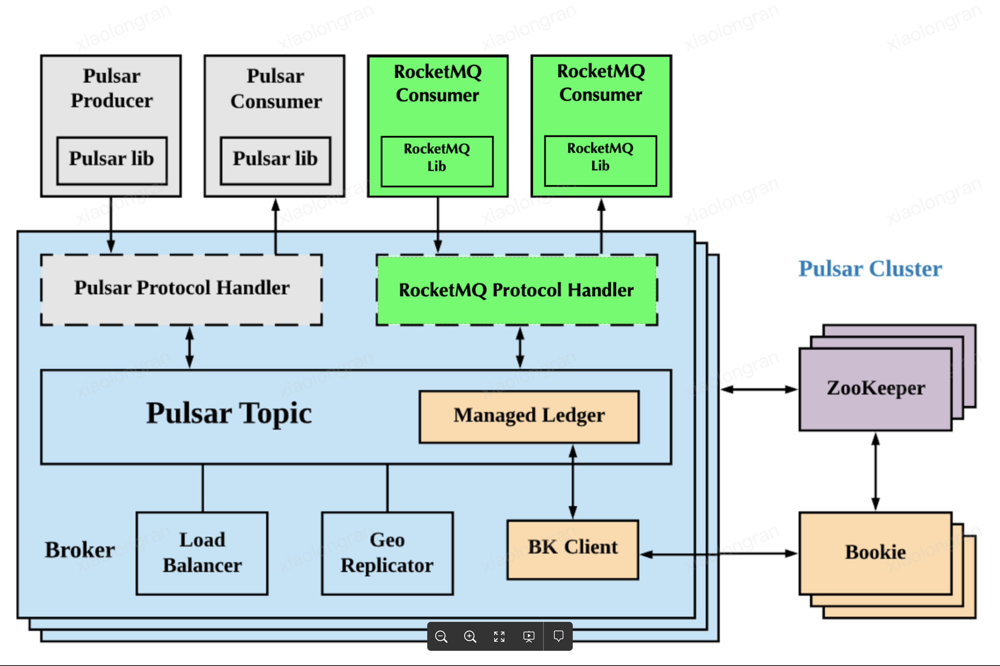

# RocketMQ on Pulsar(RoP)

RoP stands for RocketMQ on Pulsar. Rop broker supports RocketMQ-4.6.1 protocol, and is backed by
Pulsar.

RoP is implemented as a
Pulsar [ProtocolHandler](https://github.com/apache/pulsar/blob/master/pulsar-broker/src/main/java/org/apache/pulsar/broker/protocol/ProtocolHandler.java)
with protocol name "rocketmq". ProtocolHandler is build as a nar file, and is loaded when Pulsar
Broker starts.



## Limitations

RoP is implemented based on Pulsar features. However, the methods of using Pulsar and using RocketMQ
are different. The following are some limitations of RoP.

- TBD
- TBD

## Get started

In this guide, you will learn how to use the Pulsar broker to serve requests from RocketMQ client.

### Download Pulsar

Download [Pulsar 2.7.1](https://github.com/streamnative/pulsar/releases/download/v2.7.1/apache-pulsar-2.7.1-bin.tar.gz)
binary package `apache-pulsar-2.7.1-bin.tar.gz`. and unzip it.

### Download and Build RoP Plugin

You can download rop nar file from the [RoP sources](https://git.code.oa.com/csig_tdmq/rop).

To build from code, complete the following steps:

1. Clone the project from GitHub to your local.

```bash
git clone git@git.code.oa.com:csig_tdmq/rop.git
cd rop
```

2. Build the project.

```bash
mvn clean install -DskipTests
```

You can find the nar file in the following directory.

```bash
./target/tdmq-protocol-handler-rocketmq-parent-${version}.nar
```

### Configuration

|Name|Description|Default|
|---|---|---|
rocketmqTenant|RocketMQ on Pulsar broker tenant|public
rocketmqListeners|RocketMQ service port|rocketmq://127.0.0.1:9876
rocketmqMaxNoOfChannels|The maximum number of channels which can exist concurrently on a connection|64
rocketmqMaxFrameSize|The maximum frame size on a connection|4194304 (4MB)
rocketmqHeartBeat|The default heartbeat timeout of RoP connection|60 (s)

### Configure Pulsar broker to run RoP protocol handler as Plugin

As mentioned above, RoP module is loaded with Pulsar broker. You need to add configs in Pulsar's
config file, such as `broker.conf` or `standalone.conf`.

1. Protocol handler configuration

You need to add `messagingProtocols`(the default value is `null`) and  `protocolHandlerDirectory` (
the default value is "./protocols"), in Pulsar configuration files, such as `broker.conf`
or `standalone.conf`. For RoP, the value for `messagingProtocols` is `rocketmq`; the value
for `protocolHandlerDirectory` is the directory of RoP nar file.

The following is an example.

```access transformers
messagingProtocols=rocketmq
protocolHandlerDirectory=./protocols
```

2. Set RocketMQ service listeners

Set RocketMQ service `listeners`. Note that the hostname value in listeners is the same as Pulsar
broker's `advertisedAddress`.

The following is an example.

```
rocketmqListeners=rocketmq://127.0.0.1:9876
advertisedAddress=127.0.0.1
```

### Run Pulsar broker

With the above configuration, you can start your Pulsar broker. For details, refer
to [Pulsar Get started guides](http://pulsar.apache.org/docs/en/standalone/).

```access transformers
cd apache-pulsar-2.7.1
bin/pulsar standalone -nss -nfw
```

### Run RocketMQ Client to verify

You can download the RocketMQ src code and run RocketMQ client.

### Log level configuration

In Pulsar [log4j2.yaml config file](https://github.com/apache/pulsar/blob/master/conf/log4j2.yaml),
you can set RoP log level.

The following is an example.

```
    Logger:
      - name: com.tencent.tdmq.handlers.rocketmq.RocketMQProtocolHandler
        level: debug
        additivity: false
        AppenderRef:
          - ref: Console
```

